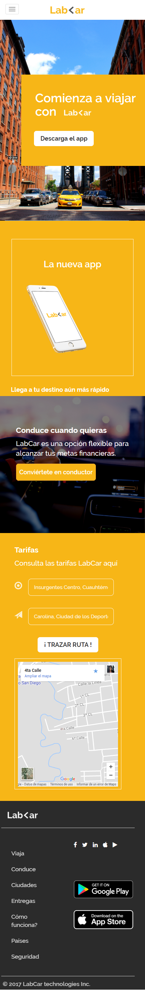
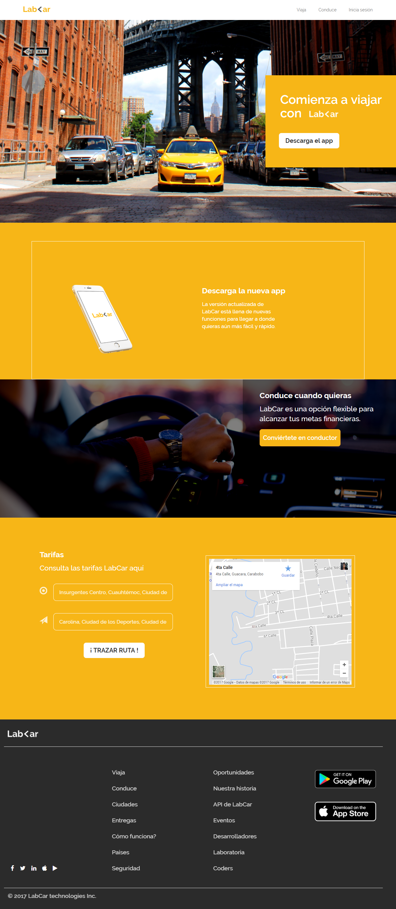
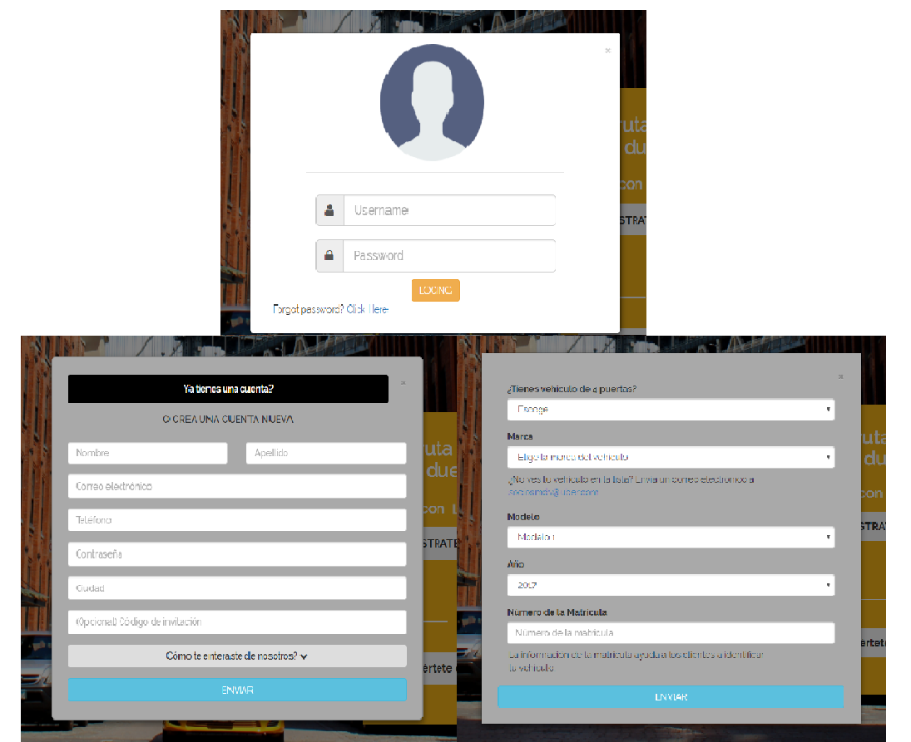

# LabCar

***
## Se utilizó

`HTML`   `CSS` `Framework Bootstrap`

## Descripción

Se trata de recrear la página web tanto para dispositivos grandes como para moviles, el trabajo tiene q ser mobile first
es por eso que la estructura principal la trabaje para móvil. En este reto además de aplicar los conocimientos en **css** y **html**
se debía utilizar Bootstrap.

Además deben de haber 3 modales para la versión web para Inicio de Sesión, Registro y la opción de Conviértete en conductor.

## Trabajo terminado

### Versión para móviles

### Versión para dispositivos grandes

### Modales

## Especificaciones

* Esta web utilizó la tipografía: `Raleway`.
* Los íconos de redes sociales son de [Font Awesome](http://fontawesome.io/).
* Otros íconos en la sección del mapa son de Bootstrap - Glyphicons.

`Nota:`

*Este trabajo se ha subido a gh-pages [aquí](https://yaniraab.github.io/lab-car-boilerplate/).
